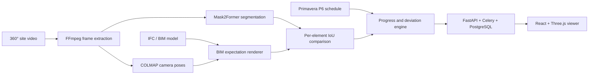

# MIQYAS

**Research prototype for construction-progress monitoring from 360° video, BIM, and Primavera P6 schedules.**

MIQYAS connects a computer-vision pipeline to a full web application: it extracts video frames, estimates camera poses, segments construction scenes, renders the expected BIM state, and compares observed and expected masks. The application then links those observations to schedule activities and exposes progress and deviation information through an IFC-aware viewer.

> **Research status:** the repository contains an explicit deterministic demo mode and an implemented real CV path. A reproducible real-world benchmark is not yet published. Screenshots and product flows may use simulated data unless stated otherwise; no production-accuracy claim is made in this README.

## Demo

| Dashboard | Executive overview | BIM viewer |
|---|---|---|
|  |  |  |

## System overview



The pipeline is modular so that reconstruction, segmentation, rendering, and comparison failures can be inspected independently instead of being hidden behind a single aggregate score.

## Implementation status

| Component | Status | Notes |
|---|---|---|
| IFC ingestion and element extraction | Implemented | Uses IfcOpenShell; stores element geometry and metadata |
| P6 XER/XML ingestion | Implemented | Parses activities, hierarchy, relationships, and schedule fields |
| Video frame extraction | Implemented | FFmpeg-based frame and keyframe processing |
| Camera reconstruction | Implemented integration | Runs COLMAP and exports mapper output to the text format consumed by the service; still requires site-specific BIM registration and validation |
| Semantic segmentation | Implemented integration | Mask2Former through Hugging Face; requires the ML dependencies and suitable compute |
| BIM expectation rendering | Implemented integration | Mesh rasterization with a bounding-box projection fallback |
| Per-element comparison | Implemented | Binary-mask IoU, confidence aggregation, and schedule-linked progress items |
| Demo mode | Implemented | Explicit `use_mock=true`; deterministic simulated masks/progress for UI and development |
| Public real-world benchmark | Not yet published | Dataset protocol, held-out split, baselines, and failure analysis are planned |

## Real and demo modes

MIQYAS does not silently replace a failed real pipeline with simulated results.

- **Real mode** is the default. It requires FFmpeg, the ML dependencies, and either COLMAP reconstruction or a validated manual alignment. A comparison that produces no progress items fails with a diagnostic error.
- **Demo mode** must be enabled explicitly with `use_mock=true`. Simulated progress items are deterministic and labelled `[SIMULATED]` in generated narratives and relevant UI surfaces.
- `GET /api/v1/system/capabilities` reports whether the current environment can run the real pipeline.

## Repository structure

```text
miqyas/
├── backend/
│   ├── app/
│   │   ├── api/v1/       # REST endpoints
│   │   ├── core/         # configuration, database, security, logging
│   │   ├── models/       # SQLAlchemy models
│   │   ├── services/     # IFC, P6, CV, storage, reports, integrations
│   │   └── tasks/        # Celery workflows
│   ├── migrations/
│   └── tests/
├── frontend/             # React, TypeScript, Vite, Three.js
├── docker/               # local and production containers
├── docs/
└── scripts/
```

## Quick start

### Prerequisites

- Python 3.11+
- Node.js 20+
- PostgreSQL 15 and Redis 7
- FFmpeg
- COLMAP for automatic camera reconstruction
- A CUDA-capable GPU is recommended for real segmentation

### Start the application

```bash
cp .env.example .env

docker compose -f docker/docker-compose.yml up -d postgres redis

cd backend
python -m venv .venv
source .venv/bin/activate
pip install -r requirements.txt
alembic upgrade head
uvicorn app.main:app --reload --host 0.0.0.0 --port 8000
```

In a second terminal:

```bash
cd backend
source .venv/bin/activate
celery -A app.tasks.worker worker -Q default,parsing,video,gpu --loglevel=info
```

In a third terminal:

```bash
cd frontend
npm ci
npm run dev
```

Open `http://localhost:5173`.

## Testing

```bash
cd backend
pytest tests/unit/ -v
ruff check app/ tests/

cd ../frontend
npm run build
```

The GitHub Actions workflow runs backend linting/tests, the frontend build, and Docker builds on pull requests to `main`.

## Evaluation contract

Any future performance result should report:

1. the dataset, sites, cameras, and collection protocol;
2. train/validation/test separation;
3. whether each pipeline stage used real or simulated inputs;
4. the exact metric—such as per-class IoU, element-presence precision/recall, or deviation-class macro F1;
5. baselines and uncertainty across runs or sites; and
6. failure cases caused by segmentation, camera/BIM alignment, occlusion, or schedule linkage.

This is intentionally stricter than reporting a single “accuracy” number: a progress-monitoring system can appear correct while one upstream stage is failing systematically.

## Technology

| Layer | Main tools |
|---|---|
| Computer vision | PyTorch, Mask2Former, OpenCV/Pillow, COLMAP, NumPy |
| BIM and scheduling | IfcOpenShell, pyrender, trimesh, custom P6 XER/XML parser |
| Backend | FastAPI, SQLAlchemy, Celery, Redis, PostgreSQL |
| Frontend | React, TypeScript, Vite, Tailwind CSS, Three.js, Recharts |
| Infrastructure | Docker, Caddy, Prometheus, Grafana, S3-compatible storage |

## Security

Never commit a local `.env` file. Copy `.env.example`, keep credentials outside Git, and use deployment-platform or repository secrets for production and CI. If a credential ever enters Git history, rotate it first and then purge the history. See [SECURITY.md](SECURITY.md).

## Current research priorities

- Validate the real pipeline on a documented multi-site split.
- Add synthetic end-to-end fixtures for reconstruction, rendering, and IoU checks.
- Calibrate confidence across segmentation and camera/BIM alignment failures.
- Compare automatic COLMAP alignment with validated manual registration.
- Report per-stage failure attribution rather than only final progress labels.

## Author

Built by [Asylkhan Kali](https://github.com/AsylkhanKali), a Computer Engineering student and AI & Computer Vision researcher at NYU Abu Dhabi.
